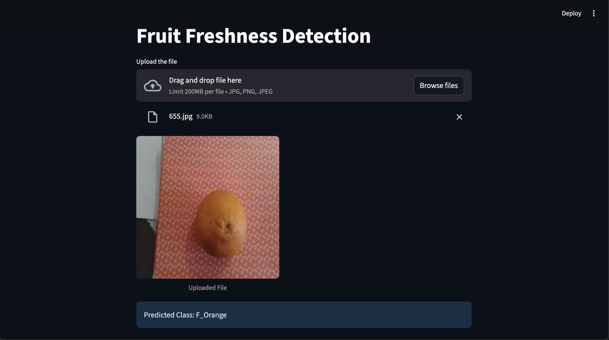

# 🍎 Fruit Freshness Detection  

A deep learning-powered application that **classifies fresh vs. stale fruits** across multiple categories.  
Built with **PyTorch**, **ResNet50 (Transfer Learning)**, and **Streamlit**.  
Live Demo – https://prajwal-glitch-fruit-freshness-detection.streamlit.app/  

---

## 🚀 Features  

- **🖼️ Image Preprocessing & Augmentation** – Applied resizing, normalization, and augmentation for robust training.  
- **🧠 Deep Learning Models** – Custom CNN vs. Transfer Learning with ResNet50, achieving ~**80% validation accuracy**.  
- **📊 Model Evaluation** – Confusion matrix, classification report, and accuracy tracking for performance insights.  
- **🌐 Web App Deployment** – Interactive Streamlit app with drag-and-drop upload for instant predictions.  
- **⚡ Real-World Use Case** – Designed for **warehousing and supply chain quality checks** of fresh produce.  

---

## 🖼️ Screenshot  

  

---

## 🛠️ Installation  

```bash
# Clone this repository
git clone https://github.com/your-username/fruit-freshness-detection.git
cd fruit-freshness-detection

# Create and activate a virtual environment (recommended)
python -m venv venv
source venv/bin/activate   # On macOS/Linux
venv\Scripts\activate      # On Windows

# Install dependencies
pip install -r requirements.txt
